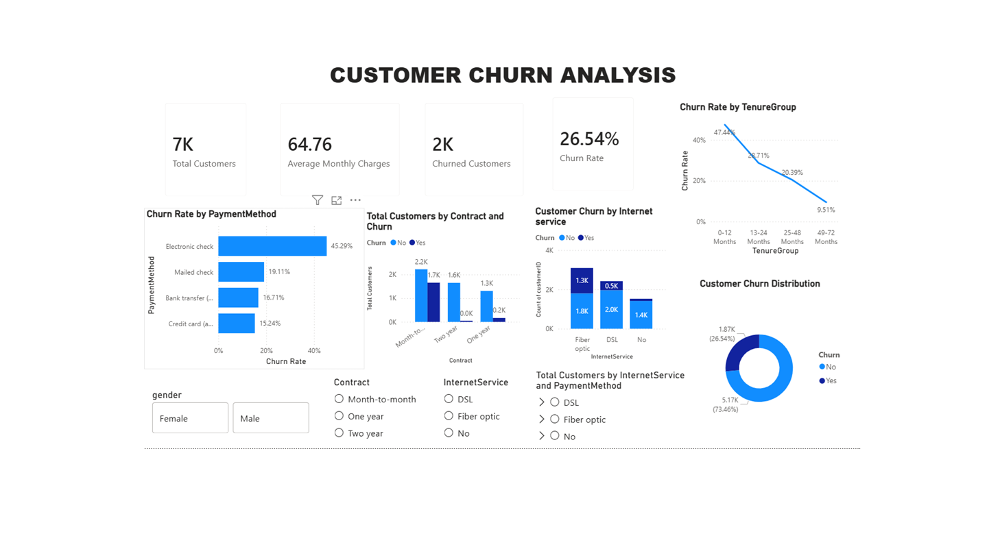

````markdown
# 📊 Customer Churn Analysis

An end-to-end **Data Analytics Project** that analyzes customer churn data to identify customer retention patterns and generate business insights using **Python, MySQL, SQL, and Power BI**. This project demonstrates the complete analytics workflow—from data cleaning and preprocessing to SQL-based analysis and interactive dashboard creation.

---

# 🚀 Project Overview

Customer churn is a major business challenge because losing existing customers can negatively impact revenue, growth, and long-term customer relationships.

This project analyzes customer data to identify the major factors associated with customer churn and understand which customer segments are more likely to leave.

The project follows a complete data analytics pipeline:

```text
Raw Dataset
     │
     ▼
Python
Data Cleaning & Preprocessing
     │
     ▼
Cleaned Dataset
     │
     ▼
MySQL / SQL
Business Analysis
     │
     ▼
Power BI
Interactive Dashboard
     │
     ▼
Business Insights
     │
     ▼
Customer Retention Recommendations
````

---

# 🎯 Objectives

* Clean and preprocess customer churn data using Python.
* Perform exploratory data analysis.
* Store and analyze the cleaned dataset using MySQL.
* Perform business analysis using SQL queries.
* Identify customer churn patterns.
* Analyze churn based on contract, tenure, payment method, internet service, and gender.
* Create an interactive Power BI dashboard.
* Develop KPIs and business-focused visualizations.
* Generate actionable business insights.
* Provide customer retention recommendations.
* Demonstrate an end-to-end Data Analytics workflow.

---

# 🛠️ Tech Stack

| Technology | Purpose                       |
| ---------- | ----------------------------- |
| Python     | Data Cleaning & Preprocessing |
| Pandas     | Data Manipulation             |
| NumPy      | Numerical Operations          |
| MySQL      | Data Storage & Analysis       |
| SQL        | Business Analysis             |
| Power BI   | Dashboard & Visualization     |
| DAX        | KPI & Measure Creation        |
| Git        | Version Control               |
| GitHub     | Project Hosting               |

---

# 📂 Dataset

The project uses a customer churn dataset containing customer demographic information, services, contract details, payment methods, charges, tenure, and churn status.

### Dataset Features

* Customer ID
* Gender
* Senior Citizen
* Partner
* Dependents
* Tenure
* Phone Service
* Multiple Lines
* Internet Service
* Online Security
* Online Backup
* Device Protection
* Tech Support
* Streaming TV
* Streaming Movies
* Contract
* Paperless Billing
* Payment Method
* Monthly Charges
* Total Charges
* Churn
* Tenure Group

---

# 📁 Project Structure

```text
Customer-Churn-Analysis/
│
├── Dataset/
│   └── cleaned_customer_churn.csv
│
├── Python/
│   └── customer_churn_analysis.ipynb
│
├── SQL/
│   └── customer_churn_analysis.sql
│
├── PowerBI/
│   ├── Customer_Churn_Analysis.pbix
│   └── Dashboard.png
│
├── README.md
├── requirements.txt
└── .gitignore
```

---

# 🧹 Data Cleaning & Preprocessing — Python

Python was used to prepare the customer churn dataset for analysis.

### Data Cleaning Steps

* Loaded the customer churn dataset.
* Inspected the dataset structure.
* Checked data types.
* Checked missing values.
* Checked duplicate records.
* Cleaned data quality issues.
* Converted numerical columns to appropriate data types.
* Prepared customer charge-related fields.
* Created customer tenure groups.
* Prepared the cleaned dataset for SQL analysis.
* Exported the cleaned dataset for further analysis and visualization.

### Python Libraries Used

```python
import pandas as pd
import numpy as np
```

The cleaned dataset was then used for MySQL analysis and Power BI visualization.

---

# 🗄️ SQL Business Analysis — MySQL

The cleaned customer dataset was imported into MySQL for structured business analysis.

### Database

```sql
CREATE DATABASE customer_churn;
```

### Main Table

```text
cleaned_customer_churn
```

### SQL Analysis Performed

* Total number of customers
* Total churned customers
* Overall churn percentage
* Churn by gender
* Churn by contract type
* Churn by tenure group
* Churn by internet service
* Churn by payment method
* Average monthly charges by churn status
* Average tenure by churn status

### SQL Concepts Used

* SELECT
* COUNT()
* SUM()
* AVG()
* ROUND()
* GROUP BY
* ORDER BY
* CASE WHEN
* Subqueries
* Aggregate Functions
* LIMIT

---

# 📊 Power BI Dashboard

An interactive **Customer Churn Analysis Dashboard** was developed using Microsoft Power BI.

The dashboard provides an overview of customer churn and helps identify customer segments with higher churn risk.


---

# 📌 Dashboard KPIs

### 👥 Total Customers

Displays the total number of customers in the dataset.

### 🚨 Churned Customers

Displays the total number of customers who have churned.

### 📉 Churn Rate

Displays the percentage of customers who have churned.

The overall churn rate shown in the dashboard is approximately:

**26.54%**

### 💰 Average Monthly Charges

Displays the average monthly charges paid by customers.

---

# 📈 Dashboard Visualizations

### 1. Customer Churn Distribution

**Chart Type:** Donut Chart

Shows the overall distribution between:

* Churned customers
* Non-churned customers

This provides a quick overview of the customer retention situation.

---

### 2. Churn Rate by Tenure Group

**Chart Type:** Line Chart

Shows how customer churn changes across different tenure groups.

This helps identify whether newer customers or long-term customers are more likely to churn.

---

### 3. Churn Rate by Payment Method

**Chart Type:** Bar Chart

Compares customer churn rates across different payment methods:

* Electronic check
* Mailed check
* Bank transfer
* Credit card

This helps identify payment-method segments with higher churn risk.

---

### 4. Customer Churn by Contract

**Chart Type:** Column Chart

Compares customer churn across different contract types:

* Month-to-month
* One year
* Two year

This helps understand the relationship between contract commitment and customer churn.

---

### 5. Customer Churn by Internet Service

**Chart Type:** Stacked Column Chart

Compares churn and non-churn customers across:

* DSL
* Fiber optic
* No internet service

This helps identify internet-service segments contributing significantly to customer churn.

---

# 🎛️ Interactive Filters

The Power BI dashboard contains interactive slicers for:

* Gender
* Contract
* Internet Service

These slicers allow users to dynamically explore customer churn patterns across different customer segments.

---

# 📊 Key Business Insights

### 1. Overall Customer Churn

The dashboard contains approximately **7K customers**, with around **1.87K churned customers**.

The overall churn rate is approximately **26.54%**, indicating that customer retention is an important business concern.

---

### 2. Customer Tenure

Customers with shorter tenure have a considerably higher churn rate compared with long-term customers.

This indicates that the early stage of the customer lifecycle is particularly important for customer retention.

---

### 3. Contract Type

Month-to-month customers show significantly higher churn compared with customers on one-year and two-year contracts.

This suggests that customers without long-term commitments are more likely to leave.

---

### 4. Payment Method

Electronic check customers have the highest churn rate among the analyzed payment methods.

This customer segment should be investigated further to understand the factors contributing to higher churn.

---

### 5. Internet Service

Fiber optic customers represent a significant customer segment and contribute substantially to the number of churned customers.

Further investigation into pricing, service quality, technical issues, and customer experience could help explain this pattern.

---

# 💡 Business Recommendations

Based on the analysis, the following strategies can help improve customer retention.

### 1. Focus on New Customers

Customers with shorter tenure have higher churn risk.

Businesses can introduce:

* Welcome programs
* Better onboarding
* Early-stage customer support
* Engagement campaigns
* Targeted introductory offers

---

### 2. Encourage Long-Term Contracts

Month-to-month customers have significantly higher churn.

Businesses can encourage customers to move toward one-year and two-year contracts through:

* Discounts
* Loyalty benefits
* Contract upgrade offers
* Long-term customer incentives

---

### 3. Investigate Electronic Check Customers

Since electronic check customers show higher churn, businesses should investigate:

* Payment experience
* Payment failures
* Billing issues
* Customer preferences
* Payment-related complaints

---

### 4. Improve Fiber Optic Customer Retention

The company should investigate fiber optic customer experience by analyzing:

* Service quality
* Pricing
* Technical issues
* Network reliability
* Customer support

---

### 5. Develop Targeted Retention Campaigns

Instead of applying the same retention strategy to every customer, businesses can identify high-risk customer segments and provide targeted retention offers.

---

# 📷 Dashboard Preview

Add the Power BI dashboard screenshot to the `PowerBI` folder and name it:

```text
Dashboard.png
```

Then use the following in the README:

```markdown

```

---

# 🚀 How to Run the Project

## Step 1 — Clone the Repository

```bash
git clone https://github.com/yourusername/Customer-Churn-Analysis.git
```

Navigate to the project folder:

```bash
cd Customer-Churn-Analysis
```

---

## Step 2 — Install Python Dependencies

Install the required Python libraries:

```bash
pip install -r requirements.txt
```

The project requires:

```text
pandas
numpy
```

---

## Step 3 — Run Python Analysis

Open the Python notebook:

```text
Python/customer_churn_analysis.ipynb
```

Run the notebook to perform data cleaning and preprocessing.

The cleaned dataset should be saved in:

```text
Dataset/cleaned_customer_churn.csv
```

---

## Step 4 — Set Up MySQL

Open **MySQL Workbench**.

Create the database:

```sql
CREATE DATABASE customer_churn;
```

Select the database:

```sql
USE customer_churn;
```

Import the cleaned customer dataset into MySQL.

Then open:

```text
SQL/customer_churn_analysis.sql
```

Execute the SQL queries to perform the customer churn analysis.

---

## Step 5 — Open Power BI

Open:

```text
PowerBI/Customer_Churn_Analysis.pbix
```

Explore the interactive dashboard.

Use the available slicers to analyze customer churn across:

* Gender
* Contract
* Internet Service

---

# 📌 Project Highlights

✔ End-to-End Data Analytics Project

✔ Data Cleaning using Python

✔ Data Preprocessing using Pandas

✔ Exploratory Data Analysis

✔ SQL Business Analysis

✔ MySQL Database Management

✔ KPI Development using DAX

✔ Interactive Power BI Dashboard

✔ Customer Churn Analysis

✔ Customer Retention Analysis

✔ Business Insight Generation

✔ Data-driven Recommendations

✔ Interactive Slicers

✔ Multiple Data Visualization Techniques

---

# 📚 Skills Demonstrated

### Programming & Data Analysis

* Python
* Pandas
* NumPy
* Data Cleaning
* Data Preprocessing
* Exploratory Data Analysis

### SQL & Database

* SQL
* MySQL
* MySQL Workbench
* Aggregate Functions
* GROUP BY
* CASE WHEN
* Subqueries
* Business Queries

### Power BI

* Power BI Dashboard Development
* Data Visualization
* DAX
* KPI Creation
* Interactive Slicers
* Business Intelligence

### Analytics

* Customer Churn Analysis
* Customer Retention Analysis
* Customer Segmentation
* Business Insight Generation
* Data-driven Decision Making

---

# 📦 Requirements

### Software Requirements

* Python 3.x
* Jupyter Notebook
* MySQL Server 8.0+
* MySQL Workbench
* Microsoft Power BI Desktop
* Git
* GitHub

### Python Requirements

```text
pandas
numpy
```

Install them using:

```bash
pip install -r requirements.txt
```

---

# 🔮 Future Enhancements

The project can be further enhanced by adding:

* Customer churn prediction using Machine Learning
* Customer segmentation
* Churn probability scoring
* Automated retention recommendations
* Customer Lifetime Value analysis
* Advanced customer risk scoring
* Automated Power BI dashboard refresh
* Power BI Service deployment

---

# 📌 Conclusion

Customer churn analysis helps businesses understand why customers leave and which customer groups require additional attention.

By combining **Python, SQL, MySQL, and Power BI**, this project transforms raw customer data into meaningful business insights and actionable customer retention strategies.

The project demonstrates a complete Data Analytics workflow:

```text
Python
   ↓
Data Cleaning
   ↓
SQL / MySQL
   ↓
Business Analysis
   ↓
Power BI
   ↓
Interactive Dashboard
   ↓
Business Insights
   ↓
Retention Recommendations
```

---

# 👩‍💻 Author

**Madhvika Reddy**

B.Tech — Computer Science Engineering

**Aspiring Data Analyst**

### Project

**Customer Churn Analysis**

### Technologies

**Python | SQL | MySQL | Power BI | DAX**

---

# ⭐ Support

If you found this project helpful, please consider giving it a ⭐ on GitHub.

```
```
